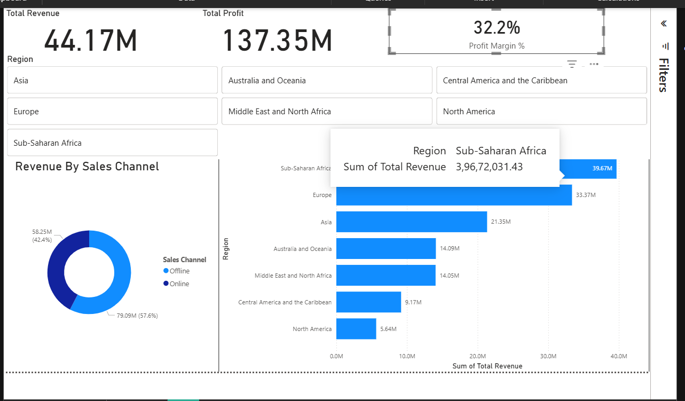

 Sales Data Full-Stack Analytics Pipeline

##  Project Overview

This project demonstrates an end-to-end full-stack data analytics workflow.

The objective was to simulate a real-world business intelligence environment where data is stored in a database, transformed using SQL, and visualized through an interactive dashboard.

Pipeline:

CSV Dataset → MySQL Database → SQL Business Logic → Power BI (Live Connection) → Interactive Dashboard


##  Tools & Technologies Used

* MySQL (Database Layer)
* SQL (Data Aggregation & Business Logic)
* Power BI (Visualization Layer)
* DAX (KPI Calculations)


##  Database Layer (MySQL)

* Created `sales_project` database
* Imported sales dataset into MySQL
* Performed aggregation queries for:

  * Total Revenue
  * Total Profit
  * Revenue by Region
  * Revenue by Sales Channel
  * Profit Margin by Region

Example Query:

```sql
SELECT `Region`,
       SUM(`Total Profit`) / NULLIF(SUM(`Total Revenue`), 0) AS Profit_Margin
FROM sales
GROUP BY `Region`
ORDER BY Profit_Margin DESC;
```


## Business Intelligence Layer (Power BI)
Connected Power BI directly to MySQL using a live database connection to enable real-time analytics.

Built:

* KPI Cards:

  * Total Revenue
  * Total Profit
  * Profit Margin (%)
* Revenue by Region (Bar Chart)
* Revenue by Sales Channel (Donut Chart)
* Interactive Region Slicer
* DAX measure for Profit Margin %


## Key Business Insights

* Sub-Saharan Africa generates the highest total revenue.
* Online sales contribute the majority share of overall revenue.
* Overall profit margin is approximately 32%.
* Revenue and profit show strong positive correlation.


## Dashboard Preview




##  What This Project Demonstrates

* Database creation and management
* SQL-based business aggregation
* Defensive programming using NULLIF
* Live database-to-BI integration
* KPI design and interactive dashboard development
* End-to-end data workflow ownership


